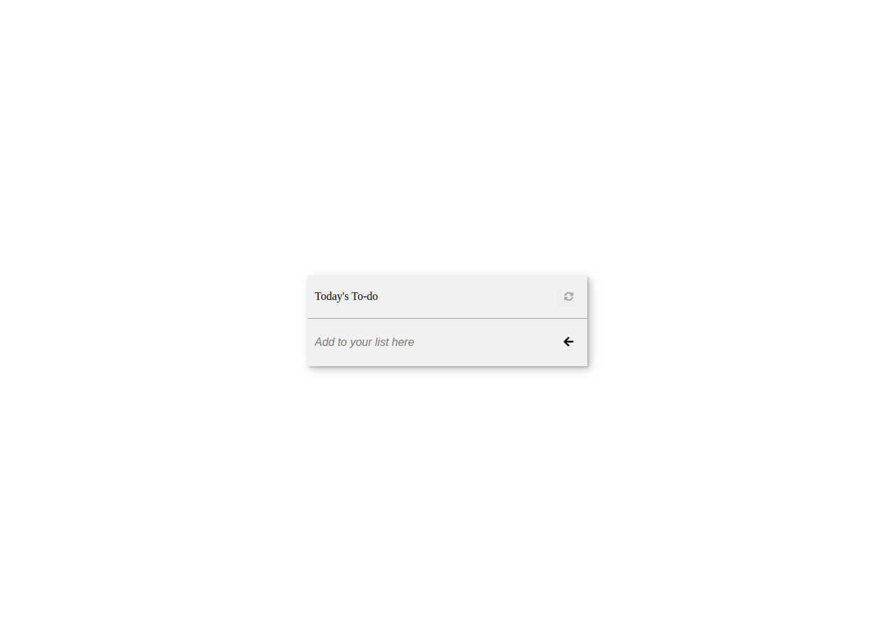

# Todo List



> This is a team project in the Microverse second Module. The project is a book application that enables a user to add and remove books to a list

The endgoal of the project is to build a todo-list application using Vanilla JavaScript and ES6 Modules with webpack.   
Click [here](https://daudi13.github.io/toDoList/) to get a live preview of the project. The project is supposed to be done in stages as follows

### stages

- Project 1: list structure
- Project 2: Interactive List
- Project 3: Add and remove items

#### Cloning the project
```
git clone  https://github.com/daudi13/toDoList/<Your-Build-Directory>
```

## Getting packages and debuging with Stylelint
```
npm install --save-dev stylelint@13.x stylelint-scss@3.x stylelint-config-standard@21.x stylelint-csstree-validator@1.x
```
##### For validation detection using Stylelint Run
```
npx stylelint "**/*.{css,scss}"
```
##### from parent source directory

## Getting packages and debuging with ESlint
```
npm install npm install --save-dev eslint@7.x eslint-config-airbnb-base@14.x eslint-plugin-import@2.x babel-eslint@10.x
```
##### For validation detection using Stylelint Run
```
npx eslint .
```
##### from parent source directory

## Getting packages and debuging with Webhint
```
npm init -y
npm install --save-dev hint@6.x
```
##### For validation detection using Webhint Run
```
npx hint .
```

 ## 🤝 Contributing

Feel free to check the [issues page](../../issues/).

## Show your support

Give a ⭐️ if you like this project!

## Authors

- David Ouma [github](https://github.com/daudi13)
## 📝 License

This project is [MIT](./LICENCE) licensed.